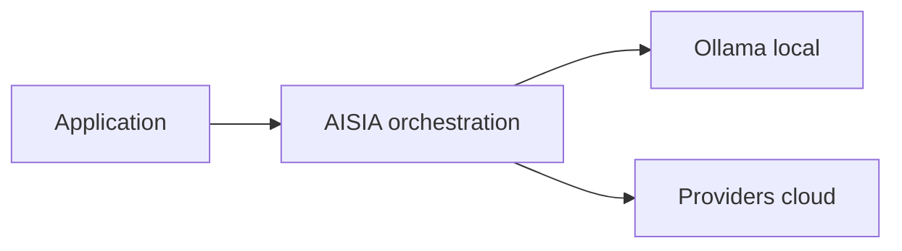

<!-- GENERATED:09_publications:start -->
<!--
  GÉNÉRÉ — ne pas éditer à la main.
  Source: scripts/generate/09_publications.py
  Régénérer: python3 scripts/aisia.py regen
  Gate deploy: python3 scripts/release/deploy.py <ver> --mode docs
-->

# terraform-azure-aisia

> **v6.12.69** — module registry — bootstrap Azure + substrat AISIA

## Cœur d'AISIA (identité produit)

AISIA est le **chef d'orchestre IA local-first** : une requête entre, le meilleur modèle (local ou cloud) exécute, la réponse sort traçable et gouvernée.

**Fonction première** : orchestrer chaque requête IA en **local-first** (Ollama sur cluster)
puis cloud si nécessaire — via `BanditRouter`, pas un simple reverse-proxy.

**Différenciation** : orchestration local-first — pas un proxy LLM stateless.

| vs proxy LLM | AISIA |
|--------------|-------|
| 1 provider fixe | **88** providers déclarés |
| Catalogue modèles | **3275** modèles catalogue · **115** locaux déclarés · **58** locaux actifs |
| Stateless | Qdrant + audit AI Act + multi-tenant |
| SaaS opaque | Déployable Swarm/K8s — **v6.12.69** LIVE |

Documentation : [README racine](../../../../README.md) ·
[Product Identity](../../../../specification/03-Project-State/Product-Identity-AISIA.md)




---
<!-- GENERATED:09_publications:end -->

## Architecture

```
Azure Resource Group
  └─ AKS Cluster (SystemAssigned identity, CNI Azure, LB Standard)
       ├─ Node pool "system" (VirtualMachineScaleSets, Standard_D2s_v3 par défaut)
       └─ Node pool "gpu" (Standard_NC4as_T4_v3, optionnel — gpu_enabled=true)
```

Région par défaut : `francecentral` (conformité RGPD).

## Usage

```hcl
provider "azurerm" {
  features {}
}

provider "kubernetes" {
  host                   = module.aisia_aks.cluster_endpoint
  client_certificate     = base64decode(module.aisia_aks.client_certificate)
  client_key             = base64decode(module.aisia_aks.client_key)
  cluster_ca_certificate = base64decode(module.aisia_aks.cluster_ca_certificate)
}

# L1 — substrat AKS
module "aisia_aks" {
  source  = "app.terraform.io/AISIA/aisia/azure"
  version = "~> 1.0"

  org_id      = "acme"
  service_key = "C1"
  image_tag   = "v6.12.69"

  location       = "francecentral"
  resource_group = "aisia-acme-rg"
  node_count     = 2
}

# L2 — déploiement AISIA sur AKS
module "aisia_app" {
  source  = "app.terraform.io/AISIA/aisia-cluster/kubernetes"
  version = "~> 1.0"

  image_tag = "v6.12.69"
  tier      = "saas"
  domain    = "acme.aisia.fr"
}
```

## Inputs

| Nom | Description | Type | Défaut | Requis |
|-----|-------------|------|--------|--------|
| `org_id` | Identifiant de l'organisation AISIA (tenant) | `string` | — | oui |
| `service_key` | Brique déployée (C1..C11) | `string` | — | oui |
| `runtime_kind` | edge \| compute \| compute-gpu \| data \| ops \| security | `string` | `"compute"` | non |
| `substrate` | Substrat cible (ce module = k8s) | `string` | `"k8s"` | non |
| `profile` | Profil de dimensionnement (S \| M \| L \| XL) | `string` | `"S"` | non |
| `node_count` | Nombre de nœuds du pool système AKS | `number` | `1` | non |
| `image_registry` | Registry des images AISIA | `string` | `"registry.aisia.fr"` | non |
| `image_tag` | Tag d'image AISIA (pour tagging Azure) | `string` | `"v6.12.69"` | non |
| `domain` | Domaine custom (vide = *.aisia.fr) | `string` | `""` | non |
| `tier` | Offre tarifaire (saas \| baas \| paas) | `string` | `"saas"` | non |
| `gpu_enabled` | Provisionner un node pool GPU (Standard_NC4as_T4_v3) | `bool` | `false` | non |
| `location` | Région Azure (francecentral = RGPD) | `string` | `"francecentral"` | non |
| `resource_group` | Nom du Resource Group Azure créé | `string` | `"aisia-aks-rg"` | non |
| `cluster_name` | Préfixe du cluster AKS | `string` | `"aisia-aks"` | non |
| `vm_size` | Taille VM nœuds AKS (Standard_D2s_v3 = 2 vCPU / 8 GB) | `string` | `"Standard_D2s_v3"` | non |
| `k8s_version` | Version Kubernetes AKS (null = recommandée Azure) | `string` | `null` | non |
| `gpu_vm_size` | Taille VM pool GPU optionnel | `string` | `"Standard_NC4as_T4_v3"` | non |

## Outputs

| Nom | Description | Sensible |
|-----|-------------|----------|
| `cluster_name` | Nom du cluster AKS | non |
| `cluster_endpoint` | Endpoint control plane AKS (API server URL) | oui |
| `kube_config_raw` | Kubeconfig brut AKS | oui |
| `client_certificate` | Certificat client AKS (base64) | oui |
| `client_key` | Clé client AKS (base64) | oui |
| `cluster_ca_certificate` | CA certificate AKS (base64) | oui |
| `kubeconfig_command` | Commande `az aks get-credentials ...` | non |
| `resource_group_name` | Nom du Resource Group créé | non |
| `location` | Région Azure du déploiement | non |
| `gpu_pool_enabled` | Node pool GPU provisionné ? | non |

## Prérequis

- OpenTofu >= 1.5 ou Terraform >= 1.5
- Provider `hashicorp/azurerm ~> 4.0`
- `az login` ou variables ARM_* d'environnement
- `provider "kubernetes"` configuré dans le root module avec les outputs sensibles
- Module `terraform-aisia-cluster ~> 1.0` pour déployer l'application

## Licence

[Mozilla Public License 2.0](LICENSE) — Copyright (c) 2026 AISIA (Sébastien Lambert).

## Référence des variables & sorties (auto-générée)

<!-- BEGIN_TF_DOCS -->
### Inputs (parité `variables.tf`)

| Name | Type | Default | Description |
|------|------|---------|-------------|
| `org_id` | `string` | `—` | Identifiant de l'organisation AISIA (tenant). |
| `service_key` | `string` | `—` | Brique déployée (C1..C11). |
| `runtime_kind` | `string` | `"compute"` | edge | compute | compute-gpu | data | ops | security. |
| `substrate` | `string` | `"k8s"` | Substrat cible. Ce module provisionne le substrat 'k8s' (AKS). |
| `profile` | `string` | `"S"` | Profil de dimensionnement (S | M | L | XL). |
| `node_count` | `number` | `1` | Nombre de nœuds du pool système AKS. |
| `image_registry` | `string` | `"registry.aisia.fr"` | Registry des images AISIA (utilisé pour le tagging ; l'app est déployée via terraform-aisia-cluster). |
| `image_tag` | `string` | `"v6.12.69"` | Tag d'image AISIA à déployer (utilisé pour le tagging Azure). |
| `domain` | `string` | `""` | Domaine custom de l'org (vide = *.aisia.fr). |
| `tier` | `string` | `"saas"` | Offre tarifaire AISIA (saas | baas | paas). |
| `gpu_enabled` | `bool` | `false` | Provisionner un node pool GPU (Standard_NC4as_T4_v3 par défaut). |
| `location` | `string` | `"francecentral"` | Région Azure (francecentral par défaut pour conformité RGPD). |
| `resource_group` | `string` | `"aisia-aks-rg"` | Nom du Resource Group Azure dédié (créé par le module). |
| `cluster_name` | `string` | `"aisia-aks"` | Nom logique du cluster AKS (préfixe des ressources). |
| `vm_size` | `string` | `"Standard_D2s_v3"` | Taille VM Azure des nœuds AKS (Standard_D2s_v3 = 2 vCPU / 8 GB RAM). |
| `k8s_version` | `string` | `null` | Version Kubernetes AKS (null = version recommandée par Azure). |
| `gpu_vm_size` | `string` | `"Standard_NC4as_T4_v3"` | Taille VM du pool GPU optionnel (Standard_NC4as_T4_v3 = 1x NVIDIA T4). |

### Outputs (parité `outputs.tf`)

| Name | Description |
|------|-------------|
| `cluster_name` | Nom du cluster AKS. |
| `cluster_endpoint` | Endpoint du control plane AKS (API server URL). |
| `kube_config_raw` | Kubeconfig brut du cluster AKS (sensible — à stocker dans un secret). |
| `client_certificate` | Certificat client AKS (base64). |
| `client_key` | Clé client AKS (base64). |
| `cluster_ca_certificate` | CA certificate AKS (base64). |
| `kubeconfig_command` | Commande pour récupérer le kubeconfig localement via az CLI. |
| `resource_group_name` | Nom du Resource Group AKS créé par le module. |
| `location` | Région Azure du déploiement. |
| `gpu_pool_enabled` | Un node pool GPU a-t-il été provisionné ? |
<!-- END_TF_DOCS -->

<!-- TF-MODULE-DOCS:09_publications -->
## Documentation AISIA

- **Documentation produit** : [aisia.fr/docs](https://aisia.fr/docs)
- **Référence API** : [api.aisia.fr/docs](https://api.aisia.fr/docs)
- **Provider Terraform** : [aisia-foundation/aisia](https://registry.terraform.io/providers/aisia-foundation/aisia/latest/docs)
- **Guide d'implémentation** : [getting-started](https://registry.terraform.io/providers/aisia-foundation/aisia/latest/docs/guides/getting-started)
- **Version LIVE** : **v6.12.69**

<!-- TF-REGISTRY-STATUS -->
## Statut publication registry (honnête)

> Mesuré à la régénération docs · version repo **v6.12.69** (`VERSION` modules + provider).

| Artefact | Repo | Public registry.terraform.io |
|----------|------|------------------------------|
| Provider `aisia-foundation/aisia` | `6.12.69` | ⚠️ non mesuré (provider: <urlopen error [SSL: CERTIFICATE_VERIFY_FAILED] certificate verify failed: unable to get local issuer certificate (_ssl.c:1032)>) |
| Module `terraform-aisia-cluster` (`cluster/aisia`) | `6.12.69` | ⚠️ non mesuré (offline) |
| Module `terraform-aisia-swarm` (`swarm/aisia`) | `6.12.69` | ⚠️ non mesuré (offline) |
| Module `terraform-aws-aisia` (`aisia/aws`) | `6.12.69` | ⚠️ non mesuré (offline) |
| Module `terraform-azure-aisia` (`aisia/azure`) | `6.12.69` | ⚠️ non mesuré (offline) |
| Module `terraform-google-aisia` (`aisia/google`) | `6.12.69` | ⚠️ non mesuré (offline) |
| Module `terraform-ovh-aisia` (`aisia/ovh`) | `6.12.69` | ⚠️ non mesuré (offline) |
| Module `terraform-scaleway-aisia` (`aisia/scaleway`) | `6.12.69` | ⚠️ non mesuré (offline) |

HCP privé (`app.terraform.io/AISIA`) : non interrogé ici (token fondateur). Ne pas écrire « 100 % registry » si une ligne public est absente ou en écart.

